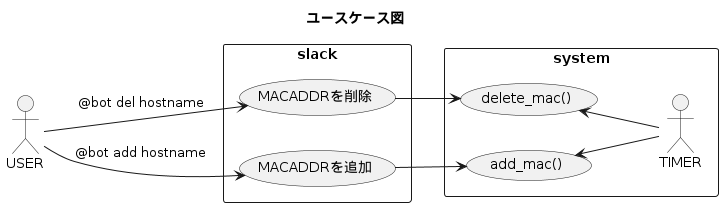
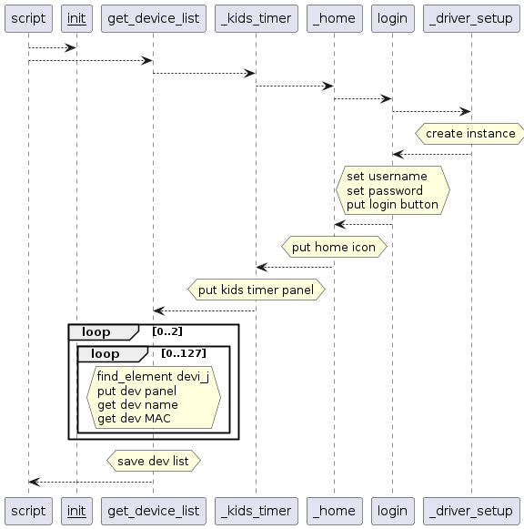
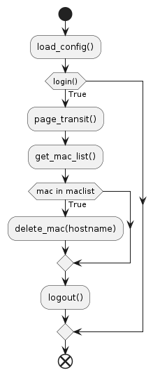
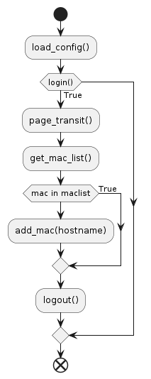
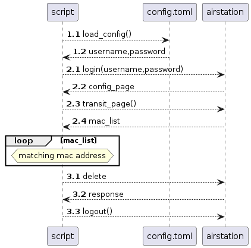

# ap-control

AirStation WSR-A2533DHP3 の設定変更ページを操作するスクリプト

## TODO

次にやること

- loggerのログを整理．常にログに残すinfo，警告のwarning，デバッグの時にだけ使うdebug
- 遷移図，シーケンス図のアップデート

## 要件

- slackをUIとする
    - [slack-companion](https://github.com/hadacchi/slack-companion)からロードすることで解決する
- slackでbotを指定して add/del ホスト名 を指定すると，システムが airstation の設定画面を操作し，設定変更後，ログアウトする
- システムはホスト名とMacアドレスの対応表を持つ
- システムはホストの登録状況を確認しエラーを起こさないよう指示を実行する

## ページ遷移

AirStationのページ遷移は以下を想定する．

## ユースケース図

## シーケンス図

デバイスリスト保存

削除シーケンス

追加シーケンス

## フローチャート

del_func

