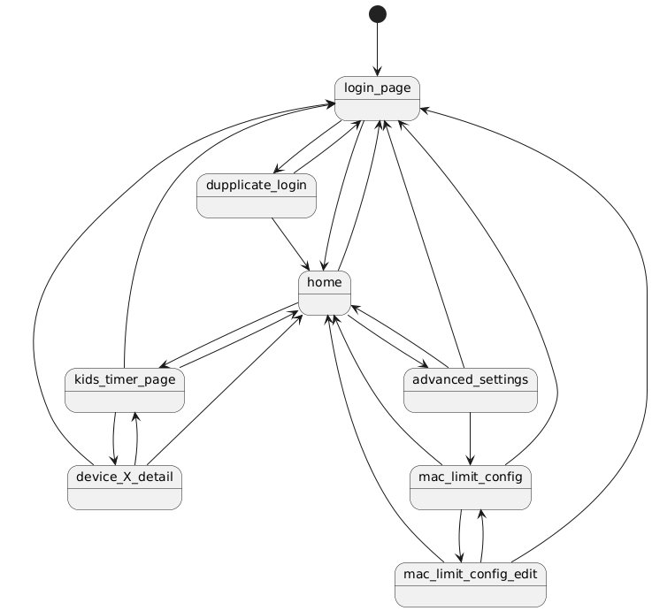

# as_control

- AirStation WSR-A2533DHP3 の設定変更ページを操作する機能を提供します
- [slack-companion](https://github.com/hadacchi/slack-companion) のpluginとして動作します

## installation

- [slack-companion](https://github.com/hadacchi/slack-companion) が導入できていることを前提とします
- [slack-companion](https://github.com/hadacchi/slack-companion) のpluginsディレクトリで，本リポジトリを `ap` という名前でクローンします (この名前がサブコマンドの名称になります)
    - ```
      cd plugins
      git clone https://github.com/hadacchi/as_control.git ap
      ```
- 本リポジトリの `ap_config.sample.toml` を [slack-companion](https://github.com/hadacchi/slack-companion) の `main.py` と同じ階層に配置します
    - ```
      cp plugins/as_control/ap_config.sample.toml ap_config.toml
      ```
- [slack-companion](https://github.com/hadacchi/slack-companion) の設定ファイル `secret.toml` へ設定ファイルのパスを追加します
    - ```toml
      [ap]
      config_file = "ap_config.toml"
      ```


## ページ遷移

AirStationのページ遷移は以下を想定する．



## シーケンス図

削除シーケンス  


追加シーケンス  


## フローチャート

デバイスリスト保存  


del_func  

